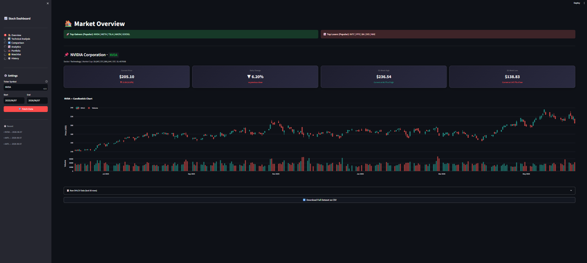
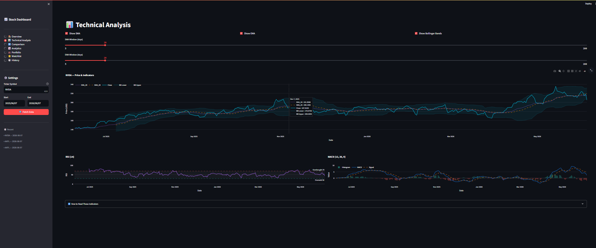
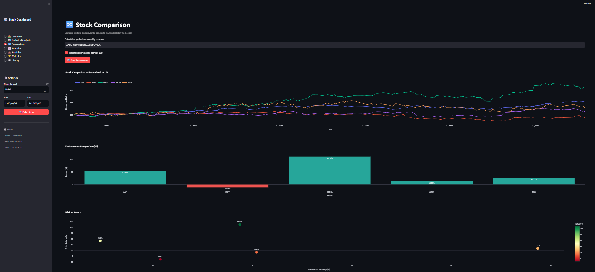
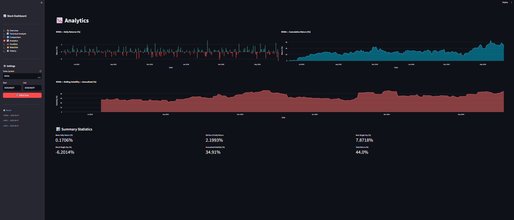
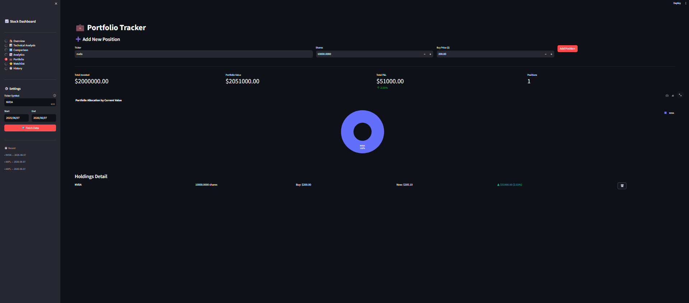

# Stock Market Analysis Dashboard
### A Complete Build-It-Yourself Tutorial Guide


A web-based stock market dashboard built with Python and Streamlit. Users can analyze stocks using live Yahoo Finance data, apply technical indicators, compare multiple stocks, and track a personal portfolio — all in a dark-themed interactive interface.

This README is a **complete step-by-step tutorial**. Follow it phase by phase to build the entire project yourself from scratch.

---

## Repository Structure

```text
Stock_Market_Dashboard/
│
├── app.py                  ← Main Streamlit entry point
├── requirements.txt        ← All Python dependencies
│
├── utils/
│   ├── data_loader.py      ← Yahoo Finance API calls + caching
│   ├── indicators.py       ← SMA, EMA, RSI, MACD, Bollinger Bands
│   ├── charts.py           ← All Plotly figure builders
│   └── database.py         ← SQLite CRUD operations
│
├── database/
│   └── stock.db            ← Auto-created on first run
│
├── assets/                 ← Static files (logos, icons)
├── screenshots/            ← App screenshots for README
└── README.md
```

| File | Lines | Responsibility |
|------|-------|---------------|
| `app.py` | ~350 | Page routing, layout, session state |
| `data_loader.py` | ~80 | All yfinance API calls |
| `indicators.py` | ~90 | Technical indicator math |
| `charts.py` | ~220 | Every Plotly chart |
| `database.py` | ~110 | SQLite: history, watchlist, portfolio |

---

## Learning Outcomes

After building this project you will be able to:

- Fetch live financial data from a public API using Python
- Compute and interpret technical analysis indicators
- Build a multi-page web application with Streamlit
- Design and query an SQLite database from Python
- Create interactive charts with Plotly
- Structure a Python project with a clean modular architecture
- Deploy a Python web app to the cloud

---

## Prerequisites

| Topic | Required Level |
|-------|---------------|
| Python | Intermediate |
| Pandas DataFrames | Basic |
| HTML / CSS | Not required |
| SQL | Basic |
| Machine Learning | Not required (optional module) |

---

## Table of Contents

1. Project Overview
2. Features
3. Tech Stack
4. System Architecture
5. Project Structure
6. Phase 1 — Basic Dashboard
7. Phase 2 — Technical Indicators
8. Phase 3 — Comparison System
9. Phase 4 — Database Integration
10. Phase 5 — Portfolio Tracker
11. Phase 6 — Deployment
12. Full Installation Guide
13. Usage Guide
14. Screenshots
15. Future Improvements
16. References

---

## 1. Project Overview

### 1.1 What This Project Does

This dashboard lets any user analyze real stock market data without writing code. It pulls historical and live data from Yahoo Finance, processes it with Python, stores activity in a local SQLite database, and presents everything through a dark-themed responsive web interface.

### 1.2 Why This Project Is Portfolio-Worthy

| Skill Area | What This Project Demonstrates |
|-----------|-------------------------------|
| API Integration | Fetching data from Yahoo Finance with yfinance |
| Data Engineering | Cleaning, transforming, and computing on DataFrames |
| Signal Processing | Computing SMA, EMA, RSI, MACD, Bollinger Bands |
| Database Design | SQLite schema: three normalized tables |
| Web Development | Multi-page Streamlit app with sidebar navigation |
| Data Visualization | 12 different interactive Plotly chart types |
| Software Architecture | Modular separation of concerns across 5 files |
| Deployment | Streamlit Cloud or Docker deployment |

### 1.3 Real-World Example

A final-year student wants to analyze whether AAPL stock is overbought before their portfolio review. They open the dashboard, search AAPL, check the RSI (above 70 = overbought), look at the MACD crossover, and compare it against MSFT and GOOGL over the same period — all in under 2 minutes, with no spreadsheets.

---

## 2. Features

### Core Features

- Search any stock by ticker symbol (US, Indian NSE/BSE, crypto, ETFs)
- Fetch OHLCV historical data via yfinance for any date range
- Interactive dark-themed candlestick chart with volume subplot
- 4 KPI cards: Current Price, Daily Change, 52-Week High, 52-Week Low
- Download data as CSV

### Technical Indicators

- Simple Moving Average (SMA) with adjustable window (5–200 days)
- Exponential Moving Average (EMA) with adjustable window
- Relative Strength Index (RSI) — overbought/oversold signals
- MACD with Signal line and colour-coded Histogram
- Bollinger Bands with fill region

### Comparison Module

- Compare up to 10 stocks simultaneously
- Normalised price chart (all start at 100 for fair comparison)
- Performance percentage bar chart
- Risk vs Return scatter plot

### Analytics Module

- Daily Returns bar chart (green/red by direction)
- Cumulative Returns area chart
- Rolling 21-day Annualised Volatility chart
- Summary statistics: mean return, std dev, best/worst day, total return

### Database Module

- SQLite tracks every ticker search with timestamp
- Watchlist: add/remove tickers, view live price and daily change
- Portfolio Tracker: log positions, view real-time P&L, allocation pie chart

### UI Features

- Dark mode throughout (Plotly dark template + custom CSS)
- Professional sidebar navigation with 7 pages
- Loading spinners during API calls
- Graceful error handling for invalid ticker symbols
- Responsive two-column layouts

---

## 3. Tech Stack

| Tool | Version | Why Used |
|------|---------|----------|
| Python | 3.10+ | Core language |
| Streamlit | 1.32 | Web app framework — no HTML/JS needed |
| Pandas | 2.2 | DataFrame operations for OHLCV data |
| NumPy | 1.26 | Numerical operations in indicator math |
| yfinance | 0.2.37 | Free Yahoo Finance historical data |
| Plotly | 5.19 | Interactive browser-side charts |
| SQLite3 | Built-in | Zero-config local database |
| Scikit-Learn | 1.4 | Optional prediction module |

---

## 4. System Architecture

### 4.1 High-Level Architecture

```text
┌──────────────────────────────────────────────────────────────┐
│                    User  (Web Browser)                       │
└──────────────────────────┬───────────────────────────────────┘
                           │  HTTP  localhost:8501
┌──────────────────────────▼───────────────────────────────────┐
│                   Streamlit  app.py                          │
│                                                              │
│   Sidebar          Page Router         Session State         │
│   ─────────        ──────────────      ───────────────       │
│   ticker input     🏠 Overview         df  (DataFrame)       │
│   date pickers     📊 Technical        ticker (str)          │
│   Fetch button     🔀 Comparison       info  (dict)          │
│                    📉 Analytics                              │
│                    💼 Portfolio                              │
│                    ⭐ Watchlist                              │
│                    🕐 History                                │
└───┬───────────────────────────────────────────┬─────────────┘
    │                                           │
┌───▼─────────────────────────┐   ┌─────────────▼────────────┐
│        utils/               │   │        utils/            │
│                             │   │                          │
│  data_loader.py             │   │  database.py             │
│  ├── fetch_stock_data()     │   │  ├── search_history      │
│  ├── fetch_stock_info()     │   │  ├── watchlist           │
│  └── fetch_multiple_stocks()│   │  └── portfolio           │
│                             │   │                          │
│  indicators.py              │   └────────────┬─────────────┘
│  ├── add_sma()              │                │
│  ├── add_ema()              │   ┌────────────▼─────────────┐
│  ├── add_rsi()              │   │  database/stock.db       │
│  ├── add_macd()             │   │  (SQLite — auto-created) │
│  └── add_bollinger_bands()  │   └──────────────────────────┘
│                             │
│  charts.py                  │
│  ├── candlestick_chart()    │
│  ├── rsi_chart()            │
│  ├── macd_chart()           │
│  ├── comparison_chart()     │
│  └── portfolio_pie_chart()  │
└───┬─────────────────────────┘
    │
┌───▼─────────────────────────┐
│     Yahoo Finance API       │
│  yf.download() / Ticker()   │
│  (free, no API key needed)  │
└─────────────────────────────┘
```

### 4.2 Request Flow — What Happens When You Click "Fetch Data"

```text
User clicks "Fetch Data"
        │
        ▼
Streamlit sidebar button fires
        │
        ▼
st.spinner("Fetching {ticker}…") displayed
        │
        ▼
fetch_stock_data(ticker, start, end)
  └── yf.download() → raw pd.DataFrame
  └── @st.cache_data caches for 5 minutes
        │
        ▼
apply_all_indicators(df)
  └── add_sma → add_ema → add_rsi → add_macd
  └── add_bollinger_bands → add_daily_returns
  └── add_cumulative_returns → add_volatility
        │
        ▼
save_search(ticker) → SQLite search_history table
        │
        ▼
st.session_state updated (df, ticker, info)
        │
        ▼
Active page re-renders with new data
```

### 4.3 Database Schema

```text
search_history                  watchlist
──────────────────────          ──────────────────────
id          INTEGER PK          id          INTEGER PK
ticker      TEXT NOT NULL       ticker      TEXT UNIQUE
searched_at TEXT NOT NULL       added_at    TEXT NOT NULL

portfolio
──────────────────────────────
id          INTEGER PK
ticker      TEXT NOT NULL
shares      REAL NOT NULL
buy_price   REAL NOT NULL
added_at    TEXT NOT NULL
```

### 4.4 Data Pipeline — From API to Chart

```text
yfinance API
    │
    ▼
pd.DataFrame  (OHLCV columns, DatetimeIndex)
    │
    ├── indicators.py adds columns:
    │     SMA_20, EMA_20, RSI, MACD, Signal, MACD_Hist
    │     BB_Upper, BB_Middle, BB_Lower
    │     Daily_Return, Cumulative_Return, Volatility
    │
    ▼
charts.py receives enriched DataFrame
    └── extracts needed columns
    └── builds Plotly Figure
    └── returns Figure to app.py
    └── st.plotly_chart() renders in browser
```

---

## 5. Project Structure — File-by-File

### 5.1 `app.py` — Entry Point

Responsibilities:
- Configures the Streamlit page (layout, title, icon)
- Renders the sidebar with ticker input, date pickers, and navigation
- Manages `st.session_state` so data persists when switching pages
- Routes each page to its own code block
- Never contains indicator math or chart logic — those live in utils/

### 5.2 `utils/data_loader.py` — Data Fetching

Responsibilities:
- All calls to `yfinance` live here and nowhere else
- `@st.cache_data(ttl=300)` prevents redundant API calls
- Returns empty DataFrames on failure so the UI can show an error gracefully
- `fetch_multiple_stocks()` loops over a list of tickers for the Comparison page

### 5.3 `utils/indicators.py` — Technical Indicators

Responsibilities:
- Pure Pandas/NumPy — no Streamlit or Plotly imports
- Each function accepts a DataFrame, appends columns, returns the DataFrame
- `apply_all_indicators()` is the single convenience wrapper

### 5.4 `utils/charts.py` — Visualization

Responsibilities:
- Pure Plotly — no Streamlit or database calls
- Every function returns a `go.Figure` ready for `st.plotly_chart()`
- All charts use `template="plotly_dark"` for consistent theming
- Shared colour palette dictionary `C` at the top of the file

### 5.5 `utils/database.py` — Storage

Responsibilities:
- All SQLite operations live here — no SQL in app.py
- `initialize_database()` is called once at startup to create tables if missing
- Parameterised queries (`?` placeholders) prevent SQL injection
- Returns plain lists of tuples — no ORM overhead

---

## 6. Phase 1 — Basic Dashboard

### 6.1 Goal

Build the minimum viable version: sidebar inputs, a data fetch, and a candlestick chart.

### 6.2 Files to Create

```text
Stock_Market_Dashboard/
├── requirements.txt
├── utils/
│   └── data_loader.py
└── app.py
```

### 6.3 Install Dependencies

```bash
# Create and activate a virtual environment first
python -m venv venv
source venv/bin/activate        # macOS / Linux
venv\Scripts\activate           # Windows

# Install packages
pip install streamlit pandas yfinance plotly numpy
```

### 6.4 Create `utils/data_loader.py`

This is the only file that communicates with Yahoo Finance.

```python
import yfinance as yf
import pandas as pd
import streamlit as st

@st.cache_data(ttl=300)   # cache for 5 minutes
def fetch_stock_data(ticker: str, start: str, end: str) -> pd.DataFrame:
    try:
        df = yf.download(ticker, start=start, end=end, progress=False, auto_adjust=True)
        if df.empty:
            return pd.DataFrame()
        df.index = pd.to_datetime(df.index)
        # Flatten MultiIndex columns from newer yfinance versions
        if isinstance(df.columns, pd.MultiIndex):
            df.columns = df.columns.get_level_values(0)
        return df[['Open', 'High', 'Low', 'Close', 'Volume']].dropna()
    except Exception as e:
        st.error(f"Fetch failed: {e}")
        return pd.DataFrame()
```

Why `@st.cache_data(ttl=300)`?
- Streamlit re-runs the entire script on every user interaction.
- Without caching, every button click would re-fetch from Yahoo Finance.
- `ttl=300` means the cache expires after 5 minutes, so data stays fresh.

### 6.5 Create the Minimal `app.py`

```python
import streamlit as st
from datetime import date, timedelta
from utils.data_loader import fetch_stock_data
import plotly.graph_objects as go

st.set_page_config(page_title="Stock Dashboard", layout="wide")

with st.sidebar:
    ticker     = st.text_input("Ticker Symbol", value="AAPL").upper()
    start_date = st.date_input("Start", value=date.today() - timedelta(days=365))
    end_date   = st.date_input("End",   value=date.today())
    fetch_btn  = st.button("Fetch Data", type="primary")

if fetch_btn:
    with st.spinner(f"Loading {ticker}…"):
        df = fetch_stock_data(ticker, str(start_date), str(end_date))

    if df.empty:
        st.error("No data found. Check the ticker symbol.")
    else:
        fig = go.Figure(go.Candlestick(
            x=df.index,
            open=df['Open'], high=df['High'],
            low=df['Low'],   close=df['Close'],
        ))
        fig.update_layout(template="plotly_dark", title=f"{ticker} Candlestick")
        st.plotly_chart(fig, use_container_width=True)
        st.dataframe(df.tail(20))
```

### 6.6 Run the Application

```bash
streamlit run app.py
```

The browser opens automatically at `http://localhost:8501`.

### 6.7 Expected Output After Phase 1

- Dark sidebar with ticker input, date pickers, and Fetch button
- Interactive candlestick chart renders after clicking Fetch
- Raw OHLCV data table below the chart
- Error message appears for invalid tickers instead of a crash

---

## 7. Phase 2 — Technical Indicators

### 7.1 Goal

Add SMA, EMA, RSI, MACD, and Bollinger Bands as computed columns. Display them as interactive chart overlays and subplots.

### 7.2 New Files

```text
utils/
├── indicators.py    ← NEW
└── charts.py        ← NEW
```

### 7.3 How Each Indicator Is Computed

```text
Raw Close Price Series
        │
        ├── SMA(n)     = mean of last n closing prices          → rolling().mean()
        ├── EMA(n)     = weighted mean, recent prices heavier   → ewm(span=n).mean()
        │
        ├── RSI(14)    Step 1: compute daily gains and losses
        │              Step 2: average gain and average loss over 14 days
        │              Step 3: RS = avg_gain / avg_loss
        │              Step 4: RSI = 100 − (100 / (1 + RS))
        │
        ├── MACD       MACD Line  = EMA(12) − EMA(26)
        │              Signal     = EMA(MACD Line, 9)
        │              Histogram  = MACD − Signal
        │
        └── BB         Middle = SMA(20)
                       Upper  = Middle + 2 × rolling_std(20)
                       Lower  = Middle − 2 × rolling_std(20)
```


*Moving averages (SMA, EMA) apply the same principle as fitting a trend line through noisy data — they smooth short-term fluctuations to reveal the underlying direction.*

### 7.4 Create `utils/indicators.py`

```python
import pandas as pd
import numpy as np

def add_sma(df, window=20):
    df[f'SMA_{window}'] = df['Close'].rolling(window=window).mean()
    return df

def add_ema(df, window=20):
    df[f'EMA_{window}'] = df['Close'].ewm(span=window, adjust=False).mean()
    return df

def add_rsi(df, window=14):
    delta    = df['Close'].diff()
    gain     = delta.clip(lower=0)
    loss     = (-delta).clip(lower=0)
    avg_gain = gain.ewm(com=window - 1, min_periods=window).mean()
    avg_loss = loss.ewm(com=window - 1, min_periods=window).mean()
    rs       = avg_gain / avg_loss.replace(0, float('nan'))
    df['RSI'] = 100.0 - (100.0 / (1.0 + rs))
    return df

def add_macd(df, fast=12, slow=26, signal=9):
    ema_fast        = df['Close'].ewm(span=fast,   adjust=False).mean()
    ema_slow        = df['Close'].ewm(span=slow,   adjust=False).mean()
    df['MACD']      = ema_fast - ema_slow
    df['Signal']    = df['MACD'].ewm(span=signal, adjust=False).mean()
    df['MACD_Hist'] = df['MACD'] - df['Signal']
    return df

def add_bollinger_bands(df, window=20, num_std=2.0):
    sma            = df['Close'].rolling(window=window).mean()
    std            = df['Close'].rolling(window=window).std()
    df['BB_Middle'] = sma
    df['BB_Upper']  = sma + num_std * std
    df['BB_Lower']  = sma - num_std * std
    return df

def apply_all_indicators(df):
    df = add_sma(df, 20)
    df = add_ema(df, 20)
    df = add_rsi(df)
    df = add_macd(df)
    df = add_bollinger_bands(df)
    return df
```

### 7.5 Add the Technical Analysis Page to `app.py`

```python
elif page == "📊 Technical Analysis":
    ctrl1, ctrl2, ctrl3 = st.columns(3)
    show_sma = ctrl1.checkbox("Show SMA", value=True)
    show_ema = ctrl2.checkbox("Show EMA", value=True)
    show_bb  = ctrl3.checkbox("Show Bollinger Bands", value=True)

    sma_w = st.slider("SMA Window", 5, 200, 20, step=5)
    ema_w = st.slider("EMA Window", 5, 200, 20, step=5)

    df2 = add_sma(raw.copy(), sma_w)
    df2 = add_ema(df2, ema_w)
    df2 = add_rsi(df2)
    df2 = add_macd(df2)
    df2 = add_bollinger_bands(df2)

    st.plotly_chart(line_chart_with_indicators(df2, ticker, show_sma, show_ema, show_bb))
    
    col_rsi, col_macd = st.columns(2)
    with col_rsi:
        st.plotly_chart(rsi_chart(df2))
    with col_macd:
        st.plotly_chart(macd_chart(df2))
```

### 7.6 Indicator Interpretation Reference

| Indicator | Reading | Signal |
|-----------|---------|--------|
| SMA | Price above SMA | Bullish trend |
| SMA | Price below SMA | Bearish trend |
| EMA | EMA(12) crosses above EMA(26) | Golden cross — buy signal |
| RSI | > 70 | Potentially overbought |
| RSI | < 30 | Potentially oversold |
| MACD | MACD crosses above Signal | Momentum shifting bullish |
| Bollinger | Price touches upper band | Potential reversal downward |
| Bollinger | Bands narrowing | Low volatility, breakout expected |

### 7.7 Expected Output After Phase 2

- Price line chart with SMA overlay (orange dashed), EMA overlay (purple dotted), and Bollinger Band fill
- RSI chart with 70/30 reference lines and shaded neutral zone
- MACD histogram coloured green above zero, red below zero
- Sliders to adjust SMA and EMA window lengths interactively

---

## 8. Phase 3 — Comparison System

### 8.1 Goal

Let users enter multiple ticker symbols and compare their performance over the same date range on a single normalised chart.

### 8.2 Why Normalisation Is Needed

```text
Raw prices (not comparable):
  AAPL:  $182.00
  MSFT:  $415.00
  GOOGL: $140.00

Normalised to 100 at period start (comparable):
  AAPL:  100 → 107.3  (+7.3%)
  MSFT:  100 → 112.1  (+12.1%)
  GOOGL: 100 → 104.8  (+4.8%)

Formula:
  Normalised(t) = Price(t) / Price(t=0) × 100
```


*The Risk vs Return chart in the Comparison page follows the same pattern — each stock is a point in a 2D space with volatility on the X-axis and total return on the Y-axis.*

### 8.3 Add to `data_loader.py`

```python
def fetch_multiple_stocks(tickers: list, start: str, end: str) -> dict:
    """
    Returns {ticker: pd.Series of Close prices} for every valid ticker.
    Invalid tickers are silently skipped.
    """
    result = {}
    for t in tickers:
        df = fetch_stock_data(t, start, end)
        if not df.empty:
            result[t] = df['Close']
    return result
```

### 8.4 Three Charts Generated by the Comparison Page

**Chart 1 — Normalised Price Overlay**
- All stocks start at 100
- Shows relative performance over the same period
- Built with `comparison_chart(price_data, normalize=True)`

**Chart 2 — Performance Bar Chart**
- One bar per ticker showing total percentage return
- Green bars = positive return, Red bars = negative return
- Built with `performance_bar_chart(price_data)`

**Chart 3 — Risk vs Return Scatter**
- X-axis: Annualised Volatility = std(daily returns) × √252 × 100
- Y-axis: Total period return %
- Each point is labelled with the ticker
- Ideal: upper-left (high return, low risk)
- Built with `risk_return_scatter(price_data)`

### 8.5 Expected Output After Phase 3

- Multi-stock normalised line chart with one coloured line per ticker
- Horizontal performance bar chart sorted by return
- Risk/return scatter with colour-coded dots (green = high return, red = low)

---

## 9. Phase 4 — Database Integration

### 9.1 Goal

Persist search history, watchlist tickers, and portfolio positions across app restarts using SQLite. SQLite needs no server — the entire database lives in a single file.

### 9.2 Why SQLite Over a CSV or Session State

| Storage Method | Persists After Restart | Multi-Table | Query Support |
|----------------|----------------------|-------------|--------------|
| st.session_state | No | No | No |
| CSV file | Yes | No | Manual |
| SQLite | Yes | Yes | Full SQL |

### 9.3 Table Design Decisions

`search_history` — one row per search event, never updates, only inserts. Timestamp in TEXT format (ISO 8601) for simplicity.

`watchlist` — UNIQUE constraint on ticker prevents duplicate entries. Adding the same ticker twice silently does nothing due to `INSERT OR IGNORE`.

`portfolio` — No UNIQUE constraint on ticker because a user may buy the same stock multiple times at different prices (multiple lots). Each lot has its own row.

### 9.4 Create `utils/database.py`

```python
import sqlite3, os
from datetime import datetime

DB_PATH = os.path.join(os.path.dirname(__file__), '..', 'database', 'stock.db')

def get_connection():
    os.makedirs(os.path.dirname(DB_PATH), exist_ok=True)
    return sqlite3.connect(DB_PATH)

def initialize_database():
    conn = get_connection()
    conn.execute("""CREATE TABLE IF NOT EXISTS search_history (
        id INTEGER PRIMARY KEY AUTOINCREMENT,
        ticker TEXT NOT NULL,
        searched_at TEXT NOT NULL
    )""")
    conn.execute("""CREATE TABLE IF NOT EXISTS watchlist (
        id INTEGER PRIMARY KEY AUTOINCREMENT,
        ticker TEXT UNIQUE NOT NULL,
        added_at TEXT NOT NULL
    )""")
    conn.execute("""CREATE TABLE IF NOT EXISTS portfolio (
        id INTEGER PRIMARY KEY AUTOINCREMENT,
        ticker TEXT NOT NULL,
        shares REAL NOT NULL,
        buy_price REAL NOT NULL,
        added_at TEXT NOT NULL
    )""")
    conn.commit()
    conn.close()

def save_search(ticker: str):
    conn = get_connection()
    conn.execute(
        "INSERT INTO search_history (ticker, searched_at) VALUES (?, ?)",
        (ticker.upper(), datetime.now().strftime("%Y-%m-%d %H:%M:%S"))
    )
    conn.commit()
    conn.close()
```

### 9.5 Wire the Database into `app.py`

```python
# At the very top of app.py, before any UI code:
from utils.database import initialize_database, save_search, get_recent_searches

initialize_database()   # creates tables if they don't exist

# After a successful data fetch:
save_search(ticker)

# In the sidebar, show recent searches:
recent = get_recent_searches(5)
for t, ts in recent:
    st.caption(f"• {t}  —  {ts[:10]}")
```

### 9.6 History Page

```python
elif page == "🕐 History":
    history = get_recent_searches(100)
    df_hist = pd.DataFrame(history, columns=["Ticker", "Searched At"])
    st.dataframe(df_hist, use_container_width=True)
    if st.button("Clear History"):
        clear_search_history()
        st.rerun()
```

### 9.7 Expected Output After Phase 4

- Every ticker you search is logged with date and time
- Last 5 searches appear as bullet points in the sidebar
- History page shows the full log in a table
- Clear History button deletes all records

---

## 10. Phase 5 — Portfolio Tracker

### 10.1 Goal

Let users log stock positions with ticker, number of shares, and buy price. Fetch the current price live and display unrealised profit or loss.

### 10.2 P&L Calculation Logic

```text
For each position in the portfolio table:

  Cost Value     = shares × buy_price
  Current Value  = shares × current_price    (fetched live from yfinance)
  Unrealised P&L = Current Value − Cost Value
  P&L %          = (Unrealised P&L / Cost Value) × 100

Portfolio Total
  Total Invested = Σ (shares × buy_price)  for all positions
  Total Value    = Σ (shares × current_price) for all positions
  Total P&L      = Total Value − Total Invested
```

### 10.3 Portfolio Page Structure

```text
Portfolio page layout:

┌─────────────────────────────────────────────────────┐
│  ➕ Add New Position                                 │
│  [Ticker] [Shares] [Buy Price ($)] [Add button]      │
├─────────────────────────────────────────────────────┤
│  KPI Row                                             │
│  Total Invested | Portfolio Value | Total P&L | Pos. │
├─────────────────────────────────────────────────────┤
│  Donut Chart — allocation by current value           │
├─────────────────────────────────────────────────────┤
│  Holdings Detail (one row per position)              │
│  AAPL | 10 shares | Buy $150 | Now $182 | ▲ $320    │
│  TSLA | 5 shares  | Buy $210 | Now $190 | ▼ −$100   │
└─────────────────────────────────────────────────────┘
```

### 10.4 Allocation Pie Chart

The donut chart shows how much of the portfolio's current value each position represents.

```python
from utils.charts import portfolio_pie_chart

# holdings is a list of dicts with 'ticker' and 'current_value' keys
st.plotly_chart(portfolio_pie_chart(holdings), use_container_width=True)
```

### 10.5 Expected Output After Phase 5

- Form to add positions: ticker, shares, buy price
- 4 KPI cards: total invested, current value, total P&L (with delta), number of positions
- Donut chart showing allocation by current value
- Each holding row shows buy price, current price, and P&L in green or red
- Delete button removes individual positions

---

## 11. Phase 6 — Deployment

### 11.1 Option A — Streamlit Community Cloud (Free, Recommended)

```text
Step 1  Push your project to a public GitHub repository

Step 2  Go to https://share.streamlit.io and sign in with GitHub

Step 3  Click "New app"

Step 4  Select your repository, branch (main), and main file (app.py)

Step 5  Click "Deploy"

Step 6  Streamlit reads requirements.txt automatically and installs dependencies

Step 7  Your app is live at https://your-app-name.streamlit.app
```

Note on SQLite for cloud deployment: Streamlit Cloud has an ephemeral filesystem. The database resets between restarts. For persistent storage in production, replace SQLite with a PostgreSQL database (e.g. Supabase free tier) or use Streamlit's built-in `st.connection` with a cloud database.

### 11.2 Option B — Render (Free Tier)

Create a `Procfile` in the project root:

```text
web: streamlit run app.py --server.port=$PORT --server.address=0.0.0.0
```

Then connect your GitHub repo to https://render.com as a Web Service. Render auto-detects the Procfile.

### 11.3 Option C — Docker (Local or Any Cloud)

Create `Dockerfile` in the project root:

```dockerfile
FROM python:3.10-slim

WORKDIR /app

COPY requirements.txt .
RUN pip install --no-cache-dir -r requirements.txt

COPY . .

EXPOSE 8501

CMD ["streamlit", "run", "app.py", \
     "--server.address=0.0.0.0", \
     "--server.port=8501", \
     "--server.headless=true"]
```

Build and run:

```bash
docker build -t stock-dashboard .
docker run -p 8501:8501 stock-dashboard
```

Access at `http://localhost:8501`.

---

## 12. Full Installation Guide

### 12.1 Requirements

- Python 3.10 or higher
- pip
- Git
- Internet connection (for yfinance API calls)

### 12.2 Clone the Repository

```bash
git clone https://github.com/YOUR_USERNAME/Stock_Market_Dashboard.git
cd Stock_Market_Dashboard
```

### 12.3 Set Up a Virtual Environment

```bash
# Create virtual environment
python -m venv venv

# Activate — Windows
venv\Scripts\activate

# Activate — macOS / Linux
source venv/bin/activate
```

### 12.4 Install Dependencies

```bash
pip install -r requirements.txt
```

### 12.5 Run the Application

```bash
streamlit run app.py
```

The app opens at `http://localhost:8501` automatically.

### 12.6 Verify Everything Works

```text
✅ Sidebar loads with ticker input and date pickers
✅ Type AAPL, click Fetch Data — candlestick chart appears
✅ KPI cards show price and 52-week range
✅ Technical Analysis page loads RSI and MACD charts
✅ Comparison page compares AAPL vs MSFT
✅ database/stock.db file is created automatically
✅ History page shows your searches
```

---

## 13. Usage Guide

### 13.1 Searching a Stock

```text
1. Find the sidebar on the left panel
2. Type a valid ticker symbol (see table below for examples)
3. Select start and end dates using the date pickers
4. Click "🔍 Fetch Data"
5. The dashboard loads with candlestick chart and KPI cards
```

### 13.2 Ticker Symbol Reference

| Market | Example Tickers |
|--------|----------------|
| US Stocks | AAPL, MSFT, TSLA, NVDA, GOOGL, AMZN |
| Indian NSE | RELIANCE.NS, TCS.NS, INFY.NS, HDFC.NS |
| Indian BSE | RELIANCE.BO, TCS.BO |
| Crypto | BTC-USD, ETH-USD, BNB-USD |
| ETFs | SPY, QQQ, VTI, ARKK |
| Indices | ^GSPC (S&P 500), ^NSEI (Nifty 50) |
| Forex | EURUSD=X, GBPUSD=X, USDINR=X |

### 13.3 Reading the Technical Analysis Page

- **SMA above price** → price is below its average → possible bearish signal
- **RSI approaching 70** → momentum is strong, watch for reversal
- **MACD histogram turning negative** → momentum weakening
- **Price touching lower Bollinger Band** → possible oversold bounce

### 13.4 Using the Comparison Page

```text
1. Navigate to "🔀 Comparison" in the sidebar
2. Type tickers separated by commas: AAPL, MSFT, GOOGL, AMZN
3. Leave "Normalise to 100" checked for fair comparison
4. Click "Run Comparison"
5. Three charts appear: overlay, performance bar, risk-return scatter
```

### 13.5 Portfolio Tracker

```text
1. Navigate to "💼 Portfolio"
2. Enter ticker, number of shares, and the price you paid
3. Click "Add Position"
4. Repeat for each holding
5. Live P&L updates from Yahoo Finance prices
6. Click the 🗑️ button to remove a position
```

### 13.6 Downloading Data

```text
1. Fetch any stock from the Overview page
2. Scroll to the bottom of the page
3. Click "⬇️ Download Full Dataset as CSV"
4. File saves as {TICKER}_historical_data.csv
```

---

## 14. Screenshots

> **For your submission:** Run the app, navigate to each page, take screenshots, save them to the `screenshots/` folder, then replace the placeholder text below with actual image links.

### How to Add Your Screenshots

```markdown





```

### What Each Screenshot Should Show

**Overview Page** (`screenshots/overview.png`)
- Dark sidebar with AAPL selected
- 4 KPI cards at the top (Current Price, Daily Change, 52W High, 52W Low)
- Full candlestick chart with volume subplot below

**Technical Analysis Page** (`screenshots/technical.png`)
- Price line with SMA orange dashed overlay
- EMA purple dotted overlay
- Bollinger Band shaded fill
- RSI chart below with 70/30 lines
- MACD chart with green/red histogram

**Comparison Page** (`screenshots/comparison.png`)
- 4 stocks normalised to 100 on one line chart
- Performance bar chart (green/red)
- Risk vs Return scatter with ticker labels

**Portfolio Tracker** (`screenshots/portfolio.png`)
- Add position form at the top
- 4 KPI summary cards
- Donut chart showing allocation
- Holdings table with green/red P&L per position

---

## 15. Future Improvements

### Short-Term (1–2 weeks)

- Add price prediction using Scikit-Learn Linear Regression or Random Forest
- Add a news sentiment section using NewsAPI (free tier available)
- Email alert when RSI crosses 70 or 30 for a watchlist ticker
- Export portfolio summary as a downloadable PDF

### Medium-Term (1 month)

- Add options chain data (calls/puts) using yfinance `.option_chain()`
- Add sector performance heatmap using Plotly treemap
- Add backtesting module for simple SMA crossover strategy
- Support multiple base currencies (USD, INR, EUR)

### Long-Term

- Replace SQLite with PostgreSQL for multi-user deployment
- Add user authentication with `streamlit-authenticator`
- Integrate a brokerage API (Alpaca for US, Zerodha Kite for India) for real-time signals
- Add WebSocket streaming for live price ticks
- Build a mobile-friendly version using the Streamlit mobile layout

---

## 16. References

1. yfinance Documentation — https://ranaroussi.github.io/yfinance/
2. Streamlit Documentation — https://docs.streamlit.io
3. Plotly Python Documentation — https://plotly.com/python/
4. Pandas Documentation — https://pandas.pydata.org/docs/
5. SQLite3 Python Module — https://docs.python.org/3/library/sqlite3.html
6. Investopedia — Technical Indicators Guide — https://www.investopedia.com/terms/t/technicalindicator.asp
7. Murphy, J. J. (1999). *Technical Analysis of the Financial Markets.* New York Institute of Finance.
8. Raschka, S. (2015). *Python Machine Learning.* Chapter 10. Packt Publishing.

---

**Note:** This project is for educational purposes only. It does not constitute financial advice. Never make investment decisions based solely on automated analysis. Always consult a licensed financial advisor.
